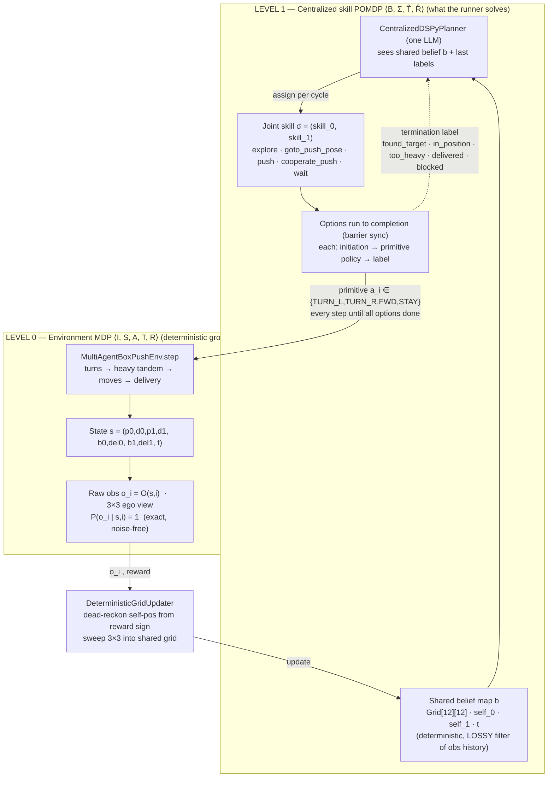

# BoxPush (Centralized) — Formal Model

Formal model of the **centralized** BoxPush runner (`env/box_push_centralized.py`):
state variables and their domains, actions, preconditions/effects, the goal as a
formula and reward function, the observations, and — since the system is
deterministic — the observation as a **function of the state** (each observation has
probability 1).

The centralized runner is **not** the flat Dec-POMDP that the per-step runner
(`box_push_per_step.py`) is. It has **two levels**:

- **Level 0 — the environment** (`MultiAgentBoxPushEnv`): a *deterministic* multi-agent
  MDP over **primitive** actions. Each agent only receives a 3×3 view, so it is
  partially observed at the raw level, but the *dynamics contain no randomness*.
- **Level 1 — what the runner actually solves**: a **single centralized decision-maker**
  (one LLM, `CentralizedDSPyPlanner`) that reads **one shared belief map** covering both
  agents and, each *cycle*, assigns **one skill (an option / temporally-extended
  macro-action) per agent**. Because there is a single decision-maker over a single
  shared belief, this level is effectively a **single-agent POMDP over the joint skill
  space**, not a Dec-POMDP. Skills run to completion over many primitive steps and return
  a **label** that is the planner's feedback signal.



Grounded in: `env/box_push_centralized.py`, `env/skill_executor_push.py`,
`../shared_skills.py`, `env/multi_agent_box_push_env.py`, `env/box_push_env.py`,
`middleware_layer/belief_updaters/deterministic_grid_updater.py`, and the shared CST
definitions `cooperative_search_transport/env/{state,constants,obs_parser}.py`.

Runner config (`box_push_centralized.py:327-329`): `12×12`, `num_agents=2`,
`num_objects=2`, `num_target_objects=2`, **`max_steps=600`**, `agent_view_size=3`,
`render_mode="human"`, `seed=42`.

---

# Level 0 — Environment (deterministic ground truth)

## I — Agents
```
I = { agent_0, agent_1 }
```
Start: `agent_0 = (10,10)`, `agent_1 = (10,9)`, both facing `LEFT`.

## S — State variables and domains
A **sufficient** state is
```
s = ( p0, d0, p1, d1, b0, del0, b1, del1, t )
```

| Variable | Meaning | Domain |
|---|---|---|
| `p0, p1` | agent positions | `(x,y) ∈ [1,10]²` (interior; outer ring is wall) |
| `d0, d1` | agent directions | `{ RIGHT=0, DOWN=1, LEFT=2, UP=3 }` |
| `b0` | box-0 position — **HEAVY** (`required_agents=2`) | `(x,y) ∈ [1,10]²`, init `(6,6)` |
| `b1` | box-1 position — **LIGHT** (`required_agents=1`) | `(x,y) ∈ [1,10]²`, init `(8,4)` |
| `del0, del1` | box delivered flags | `{ False, True }` |
| `t` | step count | `[0, 600]` |

**Static (part of the problem, not the dynamic state):**
- Grid `12×12`; walls = **outer ring only** `W = {(x,0),(x,11),(0,y),(11,y)}` (open arena,
  no interior dividers).
- Goal zone `G = {(1,y) : 1 ≤ y ≤ 10}` — the left column (10 cells).
- Both boxes are targets; **there are no decoys** in BoxPush.
- Direction vectors (MiniGrid, **y grows downward**):
  `D(RIGHT)=(1,0)`, `D(DOWN)=(0,1)`, `D(LEFT)=(-1,0)`, `D(UP)=(0,-1)`.

**State caveats worth recording:**
- A **delivered** box keeps its `position` and its rendered red sprite, but stops
  blocking (it is skipped by every occupancy check). After delivery the observation no
  longer determines occupancy of that cell.
- The CST-inherited fields `AgentState.carrying/cooperating/active` and
  `ObjectState.engaged_agents/carried_by` are **never written** in BoxPush — cooperation
  is emergent from geometry, not a state flag.

## A — Primitive actions
```
A = A0 × A1,   each Ai = { TURN_LEFT=0, TURN_RIGHT=1, MOVE_FORWARD=2, STAY=3 }
```
`action_space(agent) = Discrete(4)`. There is **no** PICK / DROP / COOPERATE action.

| Action | Effect on the acting agent |
|---|---|
| TURN_LEFT | `d ← (d−1) mod 4` |
| TURN_RIGHT | `d ← (d+1) mod 4` |
| MOVE_FORWARD | move / push per the resolution rules below |
| STAY | no-op |

## T — Transition function (deterministic): preconditions and effects
Executed in this **fixed order** each step
(`step` → `_resolve_pushes` → `_check_delivery`):

1. `t ← t + 1`; every agent's reward initialized to `−0.01`.
2. **Turns** (agent-id order): update `d` immediately. The **post-turn** direction is used
   by the movement phase in the same step (so a turning agent cannot also move; a mover
   uses whatever direction it already had).
3. **Phase A — heavy tandem push** (box-0 only, `required_agents ≥ 2`, not delivered).
   **Precondition** — all simultaneously:
   - two distinct agents `a1, a2` both chose MOVE_FORWARD this step;
   - identical direction `d` (a1's facing defines `d`);
   - **strict single file** behind the box: `p(a1) = b0 − D(d)` and `p(a2) = b0 − 2·D(d)`
     (side-by-side does **not** work);
   - destination `b0 + D(d)` is in-bounds, not a wall, not occupied by any agent, not
     occupied by another non-delivered box.
   **Effect:** `b0 ← b0 + D`, `p(a1) ← b0_old`, `p(a2) ← p(a1)_old`; each of `a1,a2`
   gets `+0.20`.
   If a tandem pair exists but the destination is infeasible: no penalty here, `a1/a2`
   fall through to Phase B.
4. **Phase B — individual movers** (agent-id order, **sequential/mutating** — `agent_0`'s
   move is visible to `agent_1`'s checks the same step). For a mover `a`, front cell
   `f = p(a) + D(d)`:
   - **empty ahead:** move iff `f` free (in-bounds, not wall, no other agent, no
     non-delivered box); else blocked, `−0.10`.
   - **heavy box ahead** (`required_agents > 1`): lone push **always fails**, `−0.10`
     (the "discover it's heavy" signal → label `too_heavy`).
   - **light box ahead** (`required_agents = 1`): push succeeds iff `dest = f + D(d)` is
     in-bounds, not wall, no agent, no other non-delivered box → `b1 ← dest`, `p(a) ← f`
     (pusher follows), `+0.10`; else `−0.10`.
5. **Delivery check:** for each undelivered target box, if its position ∈ `G` → set
   delivered, `delivered_target_count += 1`, and `+20.0` to every agent
   **Manhattan-adjacent (distance == 1)** to that box (or to **all** agents if none is
   adjacent). Asymmetric: a heavy tandem into the zone gives the front pusher `a1`
   (dist 1) the `+20` but not `a2` (dist 2).
6. **Termination / truncation** (see Horizon).

**Collision / conflict semantics** (deterministic; layout hard-coded, RNG never sampled;
ties broken by agent-id order):
- agent → wall / out-of-bounds → blocked, `−0.10`.
- agent ↔ agent contested cell → earlier agent-id wins; loser blocked, `−0.10`. Two
  agents attempting to swap both fail.
- box → wall / box → box / box → agent / box out-of-bounds → push refused, pusher stays,
  `−0.10`.

## R — Reward function (per agent, additive from the `−0.01` base)

| Case | Reward |
|---|---|
| base step (every agent, every step) | `−0.01` |
| TURN / STAY | `−0.01` |
| successful plain MOVE_FORWARD | `−0.01` |
| blocked move (wall / agent / box) or lone heavy push | `−0.11` |
| successful light push | `+0.09` |
| each participant of a heavy tandem push | `+0.19` |
| delivery, per adjacent agent (or all if none adjacent) | `+20.0` |
| all targets delivered (episode end), every agent | `+10.0` |

Constants: `_MOVE_FAIL_PENALTY=0.1`, `_LIGHT_PUSH_REWARD=0.1`, `_JOINT_PUSH_REWARD=0.2`,
`_DELIVERY_REWARD=20.0`, `_COMPLETE_BONUS=10.0`.

## Goal — as a formula over the state
```
GOAL(s)  ≡  del0 ∧ del1  ≡  (b0 ∈ G) ∧ (b1 ∈ G),      G = { (1,y) : 1 ≤ y ≤ 10 }
```
Equivalently, the shaped per-step objective is
```
R(s,a) = −0.01·|I|
       + Σ_i [ 0.10·light_push_i + 0.20·tandem_i − 0.10·blocked_i ]
       + 20·(# targets newly in G this step, credited to each adjacent agent)
       + 10·1[ (del0 ∧ del1) first becomes true this step ]
```

## Ω, O — Raw observation as a deterministic function of state
Per-agent observation `o_i = O(s, i)`, a MiniGrid Dict:
- `image`: `Box(0..255, shape=(3,3,3), uint8)` — a **3×3 egocentric, direction-rotated**
  patch; agent at bottom-center, `+depth` = straight ahead. Own cell blanked.
- `direction`: `Discrete(4)` — the agent's own facing (so direction **is** observed).
- `mission`: constant string.

Occlusion is on (`see_through_walls=False`) → cells behind walls encode as `unseen`
(type 0). Other agents are visible (type 10) and do **not** occlude. Cell encoding
`array[lateral][depth] = (type, color, state)`: wall `(2,5)`, delivery tile `(3,1)`,
target box `(7,0)`, other agent `(10,color)`, empty `(1,·)`, unseen `(0,·)`.

Deterministic and noise-free:
```
P( o_i | s, i ) = 1   for o_i = O(s, i),   0 otherwise.
```
**Not observable:** own absolute `(x,y)` (must be dead-reckoned); box **weight**
`required_agents` (red boxes are visually identical); the partner's chosen action.

## h — Horizon
Truncate at `t = 600` (`max_steps`). Natural termination when `del0 ∧ del1`. Both can
fire on the same step.

---

# Level 1 — Centralized skill-level decision process (what the runner solves)

A single centralized planner picks, each **cycle**, a **joint skill assignment**. Model
it as a single-agent POMDP `⟨ B, Σ, T̂, R̂, h_cyc ⟩` layered over Level 0.

## B — Belief state (the planner's input)
The planner reads a **shared** belief map — `box_push_centralized.py:356-364` points both
agents' updaters at one grid object:
```
b = ( Grid[12][12], self_0, self_1, last_label_0, last_label_1, t )
```
- `Grid[x][y] ∈ { unknown, empty, wall, delivery_zone, target_?/target_N }` — one shared
  map; the delivery zone is pre-seeded, everything else is `unknown` at reset.
- `self_i = (position, direction)` — position is **dead-reckoned from the reward sign**
  (`reward > −0.06` ⇒ the MOVE_FORWARD advanced); direction is read from the observation.
- `last_label_i` — the label the agent's previous skill returned (planner feedback).
- **Prior knowledge:** box **weights** are known up front (`_PRIOR_OBJECTS`); box
  **positions** are not — they must be discovered by exploring.

## Σ — Joint skill (option) space
Each cycle the planner outputs `σ = (skill_0, skill_1)` with
```
skill_i ∈ { explore, goto_push_pose[x,y], push[x,y], cooperate_push[x,y], wait }
```
(`_skill_parser`; unparseable text → `explore`). These are **options** (Sutton-style
macro-actions): each has an initiation condition, an internal policy over primitive
actions, and a termination condition that emits a **label**.

## Skills as options — preconditions, internal policy, effects, labels

| Skill | Initiation (precondition) | Internal policy (over primitives) | Terminates with label (effect) |
|---|---|---|---|
| **explore** | always | frontier BFS toward the nearest `unknown` cell | `found_target` (a box entered the shared map) / `explored` (nothing new) |
| **goto_push_pose[b]** | `b` is a known undelivered target (else nearest target; else `none_known`) | `_bfs_avoid_boxes` to the cell **behind** the box on the goal side, then face the push dir | `in_position` / `none_known` / `blocked` (no-progress 8, or 40-step backstop) |
| **push[t]** | a `TARGET_OBJECT` is in front | repeated `MOVE_FORWARD`, re-checking belief each step | `pushed` (box reached `t`) / `delivered` (box on `G`) / `too_heavy` (agent didn't advance, cell beyond free) / `blocked` (cell beyond wall/box); 30-step cap |
| **cooperate_push[b]** (needs BOTH agents same cycle) | `b` a known heavy target, tandem runway clear | deterministic slot assignment `A1=b−D`, `A2=b−2D`; each navigates to its slot (partner-aware), then a **joint** `MOVE_FORWARD` when both ready | `delivered` / `moved` / `waiting_partner` (partner not converging, 10-step wait) / `blocked` / `none_known` |
| **wait** | always | `STAY` | `done` |

Backstops (the shared map records agents as `empty`, so a stationary partner is
invisible): no-progress and stuck detectors force `blocked` / `waiting_partner` rather
than freezing (`skill_executor_push.py:119-120,160-168,250,340-351`).

## T̂ — Cycle transition (barrier-synchronized option execution)
`box_push_centralized.py:423-463`: given `σ`, instantiate both options and step them
**concurrently** — each emits a primitive each step; a finished option emits `STAY` —
through `env.step` until **all** options report `is_done` (a barrier). Level-0 `T`
advances the true state; the belief filter updates `b`. So one Level-1 transition equals
a variable-length burst of Level-0 steps. The environment dynamics are deterministic; the
*planner's policy* over Σ is stochastic (an LLM), but the **dynamics** are not.

## R̂ — Cycle reward
`R̂(b, σ) = Σ` of the Level-0 per-agent rewards accumulated over the burst — dominated by
the `+20` delivery and `+10` completion terms. The skill **labels** are the qualitative
feedback the LLM conditions on (`_RULES` maps each label to the next skill choice).

## Goal — unchanged
`GOAL ≡ del0 ∧ del1`. Task-level heuristics the planner is prompted with (`_RULES`):
LIGHT box → one agent (`goto_push_pose` + `push`); HEAVY box → both agents
`cooperate_push` **only after** a lone `push` returns `too_heavy` ("heavy is sticky");
never assign both agents to one `goto_push_pose`; never `wait` while a target is
undelivered.

## Observation as a function of state — the centralized subtlety
At **Level 0**, `o_i = O(s, i)` is an exact, probability-1 function of the state (above).
At **Level 1** the planner does **not** see `s` or even `o_i`; it sees the belief `b`,
which is a **deterministic but lossy filter of the observation history**:
```
b_t = B( o_{i, 0..t}, actions_{0..t} )      — not a function of s_t alone
```
Lossiness / known caveats:
- other agents are written as `empty` in the shared grid (no `agent` label in practice);
- self-position comes from **reward-sign dead reckoning**, which misfires on any step
  carrying the `+20` / `+10` bonus (a blocked-but-adjacent agent is falsely advanced);
- `unseen` cells leave stale belief unchanged;
- box **weight** is prior knowledge, never observed.

So: the Level-0 observation is a clean deterministic function of state (probability 1);
the Level-1 "observation" `b` is deterministic given the history but is a *lossy* encoding
of the true state. That is the honest statement of "observation probability" for the
centralized model.

---

## What makes it hard
| Challenge | Why |
|---|---|
| Partial observability | 3×3 patch of a 12×12 arena; box locations unknown at start |
| Hidden weight | `required_agents` is not observable — must be probed by pushing |
| Emergent cooperation | the heavy box needs a strict single-file, same-direction, same-step tandem |
| Sparse reward | `+20` delivery is the only large signal |
| Asymmetric credit | the tandem delivery bonus goes only to the adjacent (front) pusher |
| Coordination over options | the planner must not strand a partner mid-`cooperate_push`, nor pile both agents on the light box |
